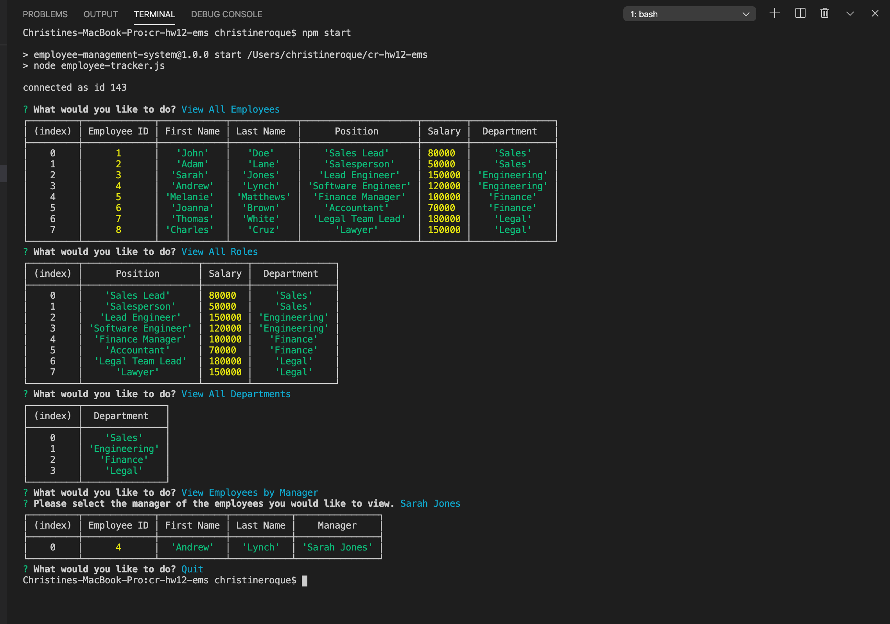

[](https://github.com/xtineroq?tab=followers)

# Employee Management System

## Description
➤ A CMS to manage a company's employee information. This application is built using nodejs, inquirer and MySQL.

## Table of Contents
* [Installation](#installation)
* [Usage](#usage)
* [License](#license)
* [Contributing](#contributing)
* [Tests](#tests)
* [Questions](#questions)
* [Video Link](#video-link)
* [Screenshot](#screenshot)

## Installation
```
Please run npm i locally to install all dependencies.
Database connection credentials can be requested from the author
or you can use the seed and schema file and run the data in your own MySQL account.
```

## Usage
➤ Please be sure to update const connection inside of employee-tracker.js with the correct details. You can then run npm start to use the application.

## License
This app is covered under the following license/s:


## Contributing
➤ Please contact the author for further information.

## Tests
```
None
```

## Questions
Please direct all questions to:

👤 https://github.com/xtineroq

📧 mcroque89@gmail.com

## Video Link
[Walkthrough Video](https://www.loom.com/share/b0eea2aa4ab0477391e11d1143ab001b)

## Screenshot
